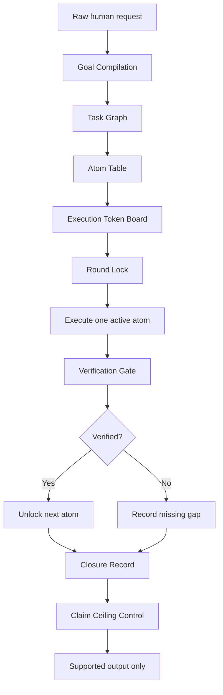

<a id="top"></a>

# Polaris Goal Compiler

> **A human AI communication protocol under WFGY 5.0 Polaris Protocol.**  
> Compile first. Execute one active atom. Verify before unlock. Claim only what is supported.


[](#what-this-is)
[](./POLARIS_GOAL_COMPILER.txt)
[](#60-second-experience)
[](../../README.md)

Natural language is a powerful interface.

But for complex AI work, raw natural language is not always a safe execution contract.

**Polaris Goal Compiler** adds the missing protocol layer between the human and the AI. Before the assistant starts producing work that looks finished, it must first turn the request into visible task atoms, active work, blocked work, verification gates, truth objects, and claim ceilings.

This is not a normal prompt template.

It is a portable TXT based execution protocol for making complex AI work easier to inspect, harder to fake, and less likely to collapse into premature completion.

---

## Start Here

| Action | Link |
|---|---|
| Download the protocol TXT | [`POLARIS_GOAL_COMPILER.txt`](./POLARIS_GOAL_COMPILER.txt) |
| Try it in 60 seconds | [60 Second Experience](#60-second-experience) |
| See what problem it solves | [Why This Exists](#why-this-exists) |
| See the mechanism | [Why It Works](#why-it-works) |
| See the full capability map | [Capability Map](#capability-map) |
| Read the FAQ | [Quick FAQ](#quick-faq) and [Deep FAQ](#deep-faq) |
| Return to Polaris main page | [WFGY 5.0 Polaris Protocol](../../README.md) |

---

<a id="what-this-is"></a>

## What This Is

Polaris Goal Compiler is the first public protocol component released under the WFGY 5.0 Polaris line.

It is designed for a very specific failure pattern:

> The user gives a complex task.  
> The AI starts writing a polished answer.  
> But the real task boundary was never compiled, verified, or closed.

Polaris Goal Compiler changes the starting point.

Instead of letting the assistant execute raw natural language directly, it asks the assistant to first produce an execution structure.

That structure makes visible:

| Field | Meaning |
|---|---|
| Active work | What can be done now |
| Blocked work | What must wait |
| Task atoms | The smallest executable units |
| Verification gates | What must be checked before unlock |
| Truth objects | What must actually become true |
| Claim ceilings | What the assistant is allowed to claim |
| Closure records | What is done, missing, partial, or unsafe |

The core idea is simple:

> AI should not produce work that merely looks complete.  
> It should expose what is active, what is blocked, what is verified, and what still cannot be claimed.

[Back to top](#top)

---

<a id="60-second-experience"></a>

## 60 Second Experience

You can test Polaris Goal Compiler in about one minute.

### Step 1

Download:

[`POLARIS_GOAL_COMPILER.txt`](./POLARIS_GOAL_COMPILER.txt)

### Step 2

Paste it into one of these places:

| Place | Use case |
|---|---|
| Ordinary AI chat | Fast manual test |
| Custom instructions | Persistent assistant behavior |
| Project rules | Coding assistant or repo level work |
| Agent rule layer | Multi step agent workflows |
| Future skill file | Wrapped protocol runtime |

### Step 3

Ask the AI:

```text
Use Polaris Goal Compiler.

First compile my request into task atoms.
Then execute only the active atom.
Do not claim final completion until verification is shown.
````

### Step 4

Give it a mixed task.

```text
Review this file, find the risky parts, repair the structure, verify what changed, and then write a short public release note.

Do not start writing the release note first.
Compile the task into atoms.
Show what is active and what is blocked.
Only execute the first active atom.
```

### What you should see

The assistant should not jump directly into the release note.

It should first separate the work.

```text
A01 Define the target
A02 Locate risky parts
A03 Repair structure
A04 Verify repair
A05 Explain verified changes
A06 Write release note
```

Only the first unlocked atom should execute.

Everything downstream should remain blocked until the required upstream state is verified.

[Back to top](#top)

---

<a id="quick-faq"></a>

## Quick FAQ

<details>
<summary>Is this just a prompt?</summary>

> No.
>
> A prompt usually tells the model what kind of answer to write.
>
> Polaris Goal Compiler tells the assistant how to compile, split, authorize, execute, verify, and limit claims before producing work that looks finished.
>
> It is closer to an execution protocol than a writing prompt.

</details>

<details>
<summary>Why would a TXT file change AI behavior?</summary>

> AI assistants are strong at pattern following.
>
> A plain TXT protocol can still shape behavior when it repeatedly defines task boundaries, active work, blocked work, verification gates, and claim limits.
>
> The goal is not to magically change the model. The goal is to give the model a clearer execution contract before it starts writing.

</details>

<details>
<summary>Does this eliminate hallucination?</summary>

> No.
>
> Polaris Goal Compiler is designed to reduce hallucination risk, fake completion, premature prose, and unsupported readiness claims.
>
> It does this by making task boundaries and verification states visible before final output is allowed.

</details>

<details>
<summary>When should I use it?</summary>

> Use it when the task is complex, multi step, risky, or easy to fake as complete.
>
> It is especially useful for coding repair, file review, audit work, documentation packaging, release preparation, repository maintenance, and long planning tasks.
>
> For simple casual chat, the protocol can run in compact mode or may not be needed.

</details>

<details>
<summary>What should I try first?</summary>

> Try a task that mixes review, repair, verification, and public writing.
>
> If the assistant starts writing the final announcement before inspection and verification, that is exactly the failure mode this protocol is designed to reduce.
>
> A good run should compile first, execute one active atom, and block downstream claims until verification is shown.

</details>

[Back to top](#top)

---

<a id="position-in-wfgy-50"></a>

## Position in WFGY 5.0

Polaris Goal Compiler is one public protocol component under **WFGY 5.0 Polaris Protocol**.

It does not expose the full private mathematical engine.

It releases a practical human AI execution layer that users can download, paste, and test immediately.

| Layer                              | Status                               |
| ---------------------------------- | ------------------------------------ |
| Human AI execution protocol        | Public through Polaris Goal Compiler |
| Portable TXT rule                  | Public                               |
| Future skill compatibility         | Designed into the structure          |
| Full WFGY 5.0 internal engine      | Not fully released here              |
| Future Polaris protocol components | Planned gradually                    |

This release follows the Polaris direction:

> expose useful public protocol layers first, then release deeper engine materials over time.

[Back to top](#top)

---

<a id="why-this-exists"></a>

## Why This Exists

Most AI failures in long tasks do not begin at the final answer.

They begin at the first boundary cut.

For simple tasks, natural language is often enough.

For complex tasks, raw natural language can become too blurry.

A user may say:

```text
Review this, fix it, verify it, and write the announcement.
```

To a model, that can collapse into one blended task.

The assistant may silently do this:

```text
review + repair + verify + explain + publish
```

as one surface level answer.

That is where fake completion begins.

| Failure                   | What happens                                         |
| ------------------------- | ---------------------------------------------------- |
| Goal merging              | Several tasks become one blurry task                 |
| Verification skipping     | The assistant writes as if checks already happened   |
| Premature prose           | Public explanation appears before truth work is done |
| Local to global promotion | One local step becomes fake total completion         |
| Unsupported readiness     | The assistant claims done before proof exists        |

Polaris Goal Compiler exists to stop that first collapse.

It puts a protocol between the human request and the assistant action.

[Back to top](#top)

---

<a id="why-it-works"></a>

## Why It Works

The mechanism is not magic.

It is task boundary control.

AI assistants are strong at pattern following. When every round exposes the same execution structure, the model receives a stable operating pattern.

Instead of guessing the whole task from raw natural language, the assistant sees a structured contract:

```text
What is active?
What is blocked?
What must be verified?
What is the truth object?
What is the claim ceiling?
What remains unresolved?
```

That repeated structure is friendly to AI behavior.

It tells the assistant:

| Signal            | Effect                               |
| ----------------- | ------------------------------------ |
| Active atom       | Do this now                          |
| Blocked atom      | Do not do this yet                   |
| Verification gate | Check before unlock                  |
| Truth object      | Do not confuse prose with completion |
| Claim ceiling     | Do not overstate readiness           |
| Closure record    | Preserve continuity across rounds    |

In plain language:

> The clearer the first boundary, the fewer chances the task has to drift.

This does not guarantee correctness.

It reduces the risk of hallucination and fake completion by making the execution boundary visible before the model starts writing.

[Back to top](#top)

---

<a id="capability-map"></a>

## Capability Map

Polaris Goal Compiler is built around execution control layers.

| Capability            | What it does                                               | What it prevents                                     |
| --------------------- | ---------------------------------------------------------- | ---------------------------------------------------- |
| Goal Compilation      | Converts raw user language into executable task structure  | Starting from an ambiguous request                   |
| Task Graph            | Maps atoms, dependencies, blocking edges, and unlock order | Jumping to downstream work too early                 |
| Count Board           | Separates task count, package count, and active atom count | Treating one local unit as the whole job             |
| Atom Table            | Records each task as a visible executable unit             | Mixing repair, verification, and writing in one step |
| Execution Token Board | Grants or denies execution authority per atom              | Doing work that has not been unlocked                |
| Round Lock            | Freezes one active atom for the current round              | Multi task drift inside one answer                   |
| Truth Object          | Defines what must actually become true                     | Treating readable prose as proof                     |
| Claim Ceiling         | Limits how strongly the assistant may claim completion     | Local success becoming fake global completion        |
| Downstream Leak Audit | Detects later stage content leaking too early              | Writing announcements before verification            |
| Closure Record        | Records verified state, missing parts, and remaining gap   | Losing track across long workflows                   |
| Portable TXT Mode     | Allows the protocol to run without a special app           | Locking the protocol to one interface                |
| Skill Compatibility   | Keeps the structure ready for future skill wrapping        | Turning the protocol into a dead document            |

The protocol is designed to make complex work more inspectable.

It does not only ask the assistant to be careful.

It gives the assistant a structure for knowing what careful means.

[Back to top](#top)

---

<a id="execution-flow"></a>

## Execution Flow



This flow is the practical core.

The assistant should not move from a raw request to final prose directly.

It should pass through compilation, authorization, execution, verification, closure, and claim control.

[Back to top](#top)

---

<a id="recommended-first-test"></a>

## Recommended First Test

Use a task that normally tempts an AI assistant to mix stages.

```text
Use Polaris Goal Compiler.

I need you to review a file, find the risky parts, repair the structure, explain what changed, and then write a short public release note.

Do not start writing the release note first.
Compile the task into atoms.
Show what is active and what is blocked.
Only execute the first active atom.
```

A good response should not immediately write the release note.

It should first produce a structure like this:

| Atom | Class              | State   |
| ---- | ------------------ | ------- |
| A01  | Define target      | Active  |
| A02  | Locate risky parts | Blocked |
| A03  | Repair structure   | Blocked |
| A04  | Verify repair      | Blocked |
| A05  | Explain changes    | Blocked |
| A06  | Write release note | Blocked |

The exact format may vary.

The required behavior should not vary:

> Compile first.
> Execute one active atom.
> Verify before unlock.
> Do not claim final completion too early.

[Back to top](#top)

---

<a id="where-to-use-it"></a>

## Where To Use It

You can use Polaris Goal Compiler in many AI workflows.

| Environment             | How to use it                                                           |
| ----------------------- | ----------------------------------------------------------------------- |
| Ordinary AI chat        | Paste the TXT and ask the assistant to use it                           |
| Custom instructions     | Add the protocol as a persistent instruction layer                      |
| Coding assistant rules  | Place it in project rules or repo level instructions                    |
| Agent workflows         | Use it as a task governance policy                                      |
| Documentation workflows | Use it before release notes, README writing, or packaging               |
| Audit workflows         | Use it to separate locate, verify, decide, and write stages             |
| Future skill systems    | Wrap the protocol into functions, panels, logs, or hidden runtime state |

Most useful scenarios:

| Scenario                | Why it helps                                                  |
| ----------------------- | ------------------------------------------------------------- |
| Coding repair           | Separates diagnosis, patching, verification, and explanation  |
| File review             | Prevents summary before actual inspection                     |
| Documentation packaging | Keeps verified facts separate from public prose               |
| Release preparation     | Blocks readiness claims until checks exist                    |
| Long planning           | Preserves task continuity across rounds                       |
| Repository maintenance  | Keeps repair, verification, and release notes from collapsing |
| Multi round work        | Keeps unfinished work visible instead of buried in prose      |

[Back to top](#top)

---

<a id="hero-figure-slot"></a>

## Hero Figure Slot

A visual effect map can be added here later.

Planned image path:

```text
./assets/polaris_goal_compiler_hero.png
```

Future image line:

```markdown

```

Planned chart dimensions:

| Dimension                     | Meaning                                          |
| ----------------------------- | ------------------------------------------------ |
| Boundary clarity              | Whether the task is split before execution       |
| Fake completion risk          | Whether local progress is promoted too early     |
| Verification visibility       | Whether checks are visible or missing            |
| Claim ceiling control         | Whether the assistant avoids unsupported claims  |
| Long task continuity          | Whether the task remains trackable across rounds |
| Downstream leakage resistance | Whether later work is blocked until unlocked     |

The first public chart should be an informal effect map, not a formal benchmark claim.

[Back to top](#top)

---

<a id="informal-effect-map"></a>

## Informal Effect Map

This table is a practical expectation guide for ordinary AI workflows.

It is not a formal benchmark result.

| Use case                     | Expected impact | Why                                                                     |
| ---------------------------- | --------------- | ----------------------------------------------------------------------- |
| Casual chat                  | Low             | Simple tasks usually do not need heavy task compilation                 |
| Simple writing               | Low to medium   | Helps keep claim boundaries clear                                       |
| Multi step writing           | Medium          | Separates planning, drafting, review, and final output                  |
| Coding repair                | Medium to high  | Prevents patch, explanation, and verification from collapsing together  |
| Audit and review             | High            | Forces active checks, blocked items, and closure records                |
| Long task packaging          | High            | Prevents local completion from being promoted to final completion       |
| Repository maintenance       | High            | Keeps repair, verification, documentation, and release claims separated |
| Multi round complex planning | High            | Preserves task continuity across rounds                                 |

Formal measurement can be added later with controlled tasks, baseline comparisons, repeated trials, and clear scoring rules.

[Back to top](#top)

---

<a id="deep-faq"></a>

## Deep FAQ

<details>
<summary>What problem is Polaris Goal Compiler really solving?</summary>

> It solves a task boundary problem.
>
> Many AI failures do not begin at the final answer. They begin when a complex human request enters the model as one blurry instruction.
>
> If the assistant does not know which part is active, which part is blocked, which part needs verification, and which claim is not yet allowed, it may produce output that looks complete while the real task is still unresolved.
>
> Polaris Goal Compiler adds a protocol layer before execution begins.

</details>

<details>
<summary>Why is natural language not enough for complex AI work?</summary>

> Natural language is excellent for communication, but it is not always a safe execution contract.
>
> A human may say, "review this, fix it, verify it, and write the release note."
>
> To a model, that can collapse into one blended task. The assistant may start writing the release note before the repair is verified.
>
> Polaris Goal Compiler forces the request to become structured before the assistant starts acting.

</details>

<details>
<summary>What is a human AI communication protocol?</summary>

> It is a shared task format between the human and the AI.
>
> The human gives a request.
>
> The assistant must first compile it into visible task atoms, dependency edges, blocked work, verification states, and claim limits.
>
> This makes the task easier for both sides to inspect.

</details>

<details>
<summary>How does task atomization reduce fake completion?</summary>

> Fake completion often happens when several task types are mixed together.
>
> For example, repair, verification, explanation, and public announcement may appear in one answer.
>
> Polaris Goal Compiler splits the work into task atoms and allows only one active atom per round.
>
> This makes it harder for the assistant to polish the surface while skipping unresolved work.

</details>

<details>
<summary>What is claim ceiling control?</summary>

> Claim ceiling control limits how strongly the assistant may describe completion.
>
> If only one local step is done, the assistant may not claim the whole task is complete.
>
> If verification is missing, the assistant may not claim verified readiness.
>
> This helps prevent local progress from being promoted into fake global completion.

</details>

<details>
<summary>What is downstream leakage?</summary>

> Downstream leakage happens when the assistant starts doing later work before earlier work is verified.
>
> Example: the assistant writes a public release note before it has finished checking whether the file is actually repaired.
>
> Polaris Goal Compiler audits this by separating active work from blocked downstream work.

</details>

<details>
<summary>Why does repeated structure help an AI model?</summary>

> AI assistants are strong at continuing patterns.
>
> If every round uses a stable execution structure, the model receives a clearer operating rhythm.
>
> It sees what is active, what is blocked, what must be verified, and what cannot be claimed yet.
>
> This does not make the model perfect. It makes the task interface less ambiguous.

</details>

<details>
<summary>Is this a replacement for verification?</summary>

> No.
>
> Polaris Goal Compiler does not replace source checking, tests, domain expertise, code execution, review, or external validation.
>
> It makes verification harder to skip.
>
> The protocol is designed to expose whether verification exists, whether it is missing, and whether a completion claim is allowed.

</details>

<details>
<summary>Is this the full WFGY 5.0 system?</summary>

> No.
>
> Polaris Goal Compiler is one public protocol component under WFGY 5.0 Polaris Protocol.
>
> It does not expose the full private mathematical engine.
>
> It releases a practical human AI execution layer that users can download, paste, and test immediately.

</details>

<details>
<summary>Can this become an AI skill later?</summary>

> Yes.
>
> The TXT version is intentionally portable.
>
> A future skill can wrap the same structure into functions, panels, logs, hidden state, forms, or runtime checks.
>
> The implementation may change, but the core structure should remain: goal compilation, task graph, atom table, execution token board, round lock, downstream leak audit, closure record, and claim ceiling control.

</details>

<details>
<summary>Can this be used in coding agents?</summary>

> Yes.
>
> It is especially useful when a coding task mixes diagnosis, patching, verification, explanation, and release notes.
>
> A coding agent can use Polaris Goal Compiler to separate what should be inspected, what should be changed, what must be tested, and what cannot yet be claimed as fixed.

</details>

<details>
<summary>What are the limits?</summary>

> Polaris Goal Compiler cannot make a weak model understand every domain.
>
> It cannot guarantee factual correctness.
>
> It cannot replace real tests, external sources, or expert review.
>
> Its practical goal is narrower: reduce task ambiguity, expose blocked work, prevent premature claims, and make fake completion easier to detect.

</details>

<details>
<summary>Is the informal effect map a benchmark?</summary>

> No.
>
> The informal effect map is a practical expectation guide.
>
> It helps users understand where the protocol is likely to be most useful.
>
> Formal benchmark claims require controlled tasks, baseline comparisons, repeated trials, and clear scoring rules.

</details>

<details>
<summary>How should contributors extend this protocol?</summary>

> Extensions should preserve the core contract.
>
> Do not remove goal compilation, task atom separation, execution token control, round lock, downstream leak audit, truth object tracking, closure records, or claim ceiling control.
>
> New features should make execution more visible, more verifiable, or harder to fake as complete.
>
> A feature that only makes the output prettier is not enough.

</details>

[Back to top](#top)

---

<a id="what-this-does-not-claim"></a>

## What This Does Not Claim

Polaris Goal Compiler is intentionally practical and bounded.

It does not claim:

| Not claimed                        | Why                                               |
| ---------------------------------- | ------------------------------------------------- |
| Universal correctness              | No protocol can guarantee every answer is correct |
| Complete hallucination elimination | The goal is risk reduction, not magical removal   |
| Replacement for tests              | Real verification still matters                   |
| Replacement for sources            | Factual work still needs evidence                 |
| Replacement for expertise          | Domain judgment still matters                     |
| Full WFGY 5.0 release              | This is one public protocol component             |
| Formal benchmark proof             | Current effect map is informal until measured     |

What it does claim:

| Claimed                           | Meaning                                                |
| --------------------------------- | ------------------------------------------------------ |
| Better task boundary visibility   | The assistant must show active and blocked work        |
| Better fake completion resistance | Local progress cannot silently become final completion |
| Better verification awareness     | Missing checks become visible                          |
| Better claim control              | The assistant should not overstate readiness           |
| Better long task continuity       | Rounds can preserve state more clearly                 |

In one sentence:

> Polaris Goal Compiler does not make the model omniscient. It makes the task interface harder to fake.

[Back to top](#top)

---

<a id="files"></a>

## Files

| File                                                       | Purpose                                                          |
| ---------------------------------------------------------- | ---------------------------------------------------------------- |
| [`POLARIS_GOAL_COMPILER.txt`](./POLARIS_GOAL_COMPILER.txt) | Portable TXT protocol. Download, paste, and use directly.        |
| `README.md`                                                | Human readable guide, quickstart, FAQ, and protocol explanation. |

Suggested use:

```text
Download the TXT.
Paste it into your AI assistant or agent rule layer.
Ask the AI to use Polaris Goal Compiler before executing complex tasks.
```

[Back to top](#top)

---

<a id="part-of-wfgy-50-polaris-protocol"></a>

## Part of WFGY 5.0 Polaris Protocol

Polaris Goal Compiler is one public protocol release under the WFGY 5.0 Polaris line.

More protocol components will be released gradually.

The goal is to make AI workflows:

| Direction                         | Meaning                                                |
| --------------------------------- | ------------------------------------------------------ |
| More structured                   | Tasks are compiled before execution                    |
| More inspectable                  | Active, blocked, and verified states are visible       |
| Less ambiguous                    | Natural language is converted into execution structure |
| Harder to fake as complete        | Completion claims must respect verification state      |
| Easier to wrap into future skills | TXT protocol can become runtime structure later        |

Main Polaris page:

[WFGY 5.0 Polaris Protocol](../../README.md)

Repository:

[WFGY](../../../README.md)

[Back to top](#top)

---

## License

This protocol follows the license policy of the parent WFGY repository unless a specific file states otherwise.

Please keep attribution when reusing, adapting, or wrapping this protocol into another assistant, agent, or skill workflow.
